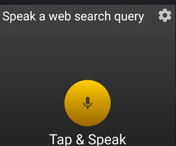
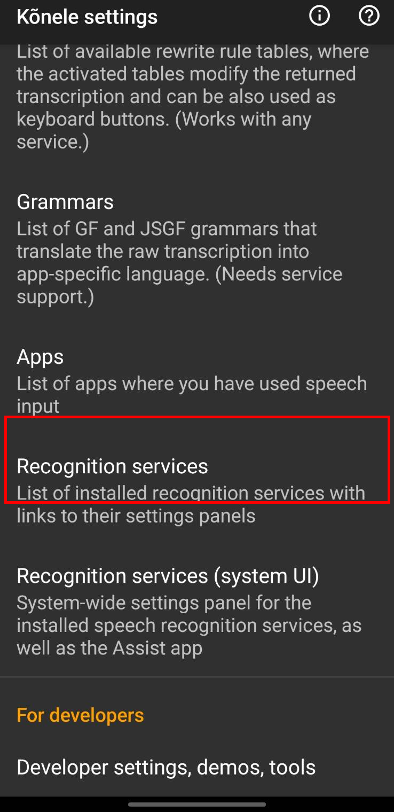
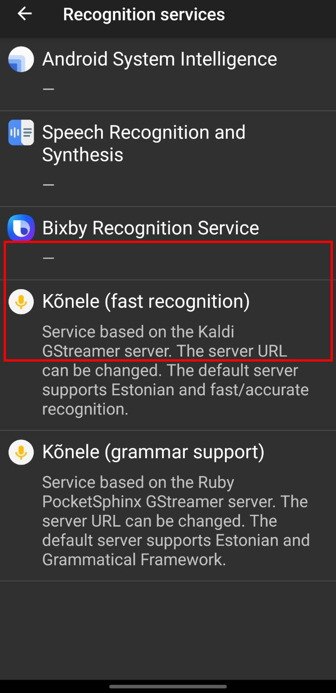

# Android Setup

This guide covers configuring Konele on your Android device to use your self-hosted Whisper server.

## Prerequisites

- Whisper Server running and accessible via Tailscale
- Android device on the same Tailscale network
- Your server's Tailscale IP (e.g., `100.64.1.42`)

## Install Tailscale

1. Install [Tailscale](https://play.google.com/store/apps/details?id=com.tailscale.ipn) from Play Store
2. Sign in with your Tailscale account
3. Ensure the VPN is connected (check for the Tailscale icon in your status bar)

## Install Konele

Konele (K6nele) is an open-source speech recognition app for Android. Install from any of these sources:

| Source | Link |
|--------|------|
| **Google Play** | [Konele on Play Store](https://play.google.com/store/apps/details?id=ee.ioc.phon.android.speak) |
| **F-Droid** | [Konele on F-Droid](https://f-droid.org/en/packages/ee.ioc.phon.android.speak/) |
| **GitHub** | [Latest APK release](https://github.com/Kaljurand/K6nele/releases) |

## Configure Konele

### Step 1: Open Settings

1. Open the **Konele** app
2. Tap the **three dots menu** (⋮) in the top-right corner
3. Select **Settings**

<!--  -->

### Step 2: Navigate to Recognition Services

1. In Settings, scroll down to find **Recognition services and languages**
2. Tap to open it

<!--  -->

### Step 3: Select Fast Recognition Service

1. Find **Kõnele (fast recognition)** in the list
2. Tap on it to configure

<!--  -->

### Step 4: Configure the WebSocket Server

1. Tap on **Service based on grammar URL**
2. Enter your Whisper server URL:

```
ws://YOUR_TAILSCALE_IP:9002/client/ws/speech
```

Replace `YOUR_TAILSCALE_IP` with your server's Tailscale IP (e.g., `100.64.1.42`).

<!--  -->

### Step 5: Set Audio Format (Critical)

The audio format must match what the server expects:

1. Find the **Content-Type** setting
2. Set it to:

```
audio/x-raw, layout=(string)interleaved, rate=(int)16000, format=(string)S16LE, channels=(int)1
```

!!! warning "Audio Format"
    Using the wrong audio format will result in garbled transcriptions or silence.

<!--  -->

### Step 6: Set as Default Service

1. Go back to **Recognition services and languages**
2. Tap **Default recognition service**
3. Select **Kõnele (fast recognition)**

<!--  -->

## Enable as Input Method

To use Konele as a voice keyboard in any app:

### Step 1: Enable in Android Settings

1. Open Android **Settings**
2. Go to **System** → **Languages & input** (or search for "keyboard")
3. Tap **On-screen keyboard** or **Virtual keyboard**
4. Tap **Manage keyboards**
5. Enable **Kõnele speech keyboard**

<!--  -->

### Step 2: Use Voice Input

When typing in any app:

1. Tap the keyboard switcher icon (usually in the navigation bar or keyboard)
2. Select **Kõnele**
3. Tap the **microphone button** to start speaking
4. Speak clearly, then pause
5. Your transcription appears in the text field

<!--  -->

## Test Your Setup

1. Open any app with a text field (e.g., Notes, Messages)
2. Switch to Konele keyboard
3. Tap the microphone and say something
4. Verify the transcription appears

If it works, you'll see your spoken text appear after a brief pause.

## Troubleshooting

### Connection Failed

- **Check Tailscale**: Ensure both devices show as connected in the Tailscale app
- **Verify server is running**: On your server, check `systemctl status whisper-server` or `docker ps`
- **Test connectivity**: From your phone's browser, try accessing `http://YOUR_TAILSCALE_IP:9002` (it won't load a page, but shouldn't timeout)

### No Transcription / Empty Results

- Verify the WebSocket URL is correct (including `/client/ws/speech` path)
- Check the Content-Type is set exactly as shown above
- Look at server logs for errors

### Garbled Transcription

- Audio format mismatch - double-check the Content-Type setting
- Try a larger Whisper model on your server (medium or large-v3)

### Slow Transcription

- Use a GPU on your server if available
- Try a smaller model (tiny or base) for faster results
- Reduce network latency by hosting the server closer to you

## Next Steps

- [Configuration](configuration.md) - Customize server options
- [Architecture](architecture.md) - Understand how it works
