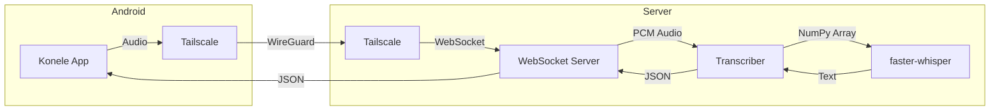
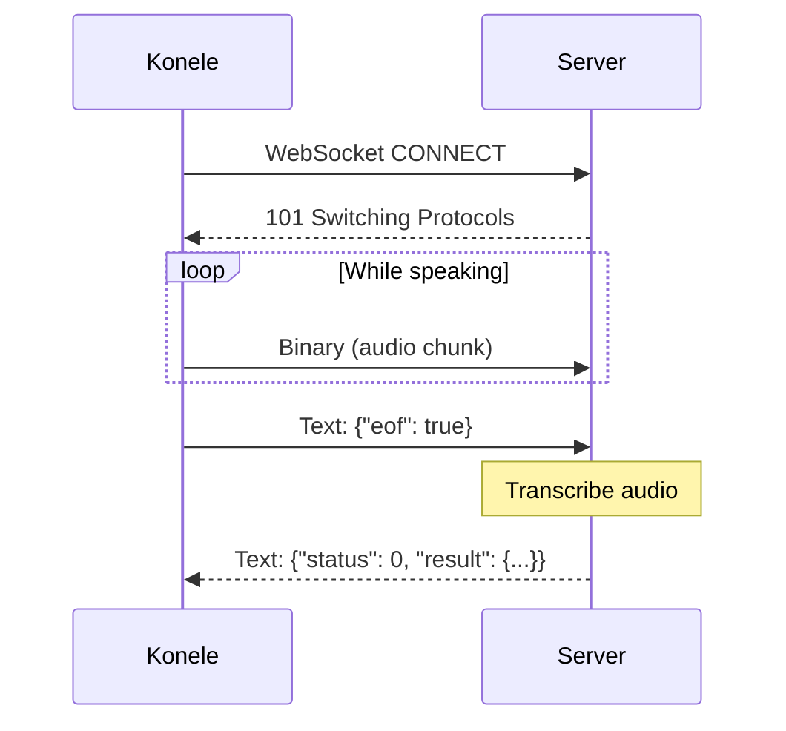
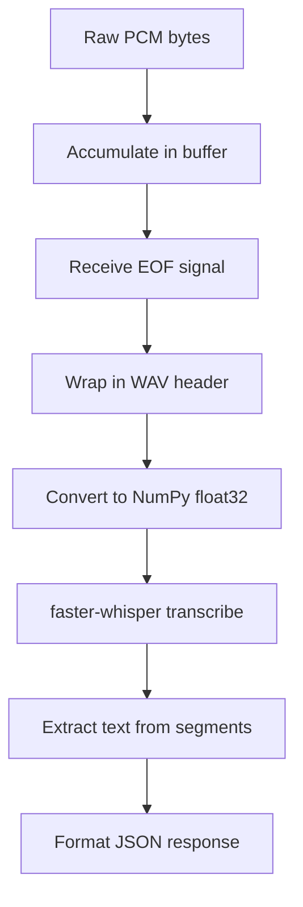

# Architecture

This document describes the system design and protocols used by Whisper Server.

## System Overview



## Components

### WebSocket Server

The server handles WebSocket connections implementing the Konele protocol:

- **Connection handling** - Accepts connections on configured port
- **Audio buffering** - Accumulates binary audio chunks
- **Control messages** - Handles JSON commands (e.g., `{"eof": true}`)
- **Response formatting** - Sends results in Konele-compatible JSON

### Transcriber

Wraps faster-whisper for audio processing:

- **Model management** - Lazy-loads Whisper model
- **Audio conversion** - Wraps raw PCM in WAV headers
- **Transcription** - Calls faster-whisper with VAD filtering

### faster-whisper

[faster-whisper](https://github.com/SYSTRAN/faster-whisper) is a CTranslate2-based reimplementation of OpenAI's Whisper:

- 4x faster than original Whisper
- Lower memory usage
- Same accuracy

## Konele Protocol

### Audio Format

Konele sends raw PCM audio with these parameters:

| Parameter | Value |
|-----------|-------|
| Sample Rate | 16000 Hz |
| Bit Depth | 16-bit signed |
| Endianness | Little-endian |
| Channels | Mono (1) |
| Encoding | Linear PCM (S16LE) |

Content-Type header:
```
audio/x-raw, layout=(string)interleaved, rate=(int)16000, format=(string)S16LE, channels=(int)1
```

### Message Flow



### Request Format

**Audio chunks**: Raw binary data (PCM audio)

**End of stream**: JSON message
```json
{"eof": true}
```

### Response Format

```json
{
  "status": 0,
  "result": {
    "hypotheses": [
      {"transcript": "transcribed text here"}
    ],
    "final": true
  }
}
```

| Field | Description |
|-------|-------------|
| `status` | 0 = success |
| `result.hypotheses` | Array of transcription candidates |
| `result.final` | true when transcription is complete |

## Audio Processing Pipeline



### WAV Wrapping

The server wraps raw PCM in a minimal WAV header:

1. RIFF header (4 bytes): `RIFF`
2. File size (4 bytes)
3. Format (4 bytes): `WAVE`
4. Format chunk: sample rate, bit depth, channels
5. Data chunk: raw PCM audio

This allows faster-whisper to process the audio without external dependencies.

### Audio Normalization

PCM int16 samples are converted to float32 in range [-1.0, 1.0]:

```python
audio_float = audio_int16.astype(np.float32) / 32768.0
```

## Security Considerations

### Network Security

- **Tailscale** provides encrypted WireGuard tunnels
- Server only listens on Tailscale interface
- No authentication in WebSocket (Tailscale handles identity)

### Resource Protection

- Audio processed synchronously (no queue buildup)
- Model loaded once at startup
- Configurable via environment (no runtime changes)

## Deployment Options

### Direct (Development)

```
[Konele] --> [Tailscale] --> [Python Server] --> [faster-whisper]
```

### Docker (Production)

```
[Konele] --> [Tailscale] --> [Docker Container] --> [faster-whisper]
```

### NixOS Systemd (Recommended)

```
[Konele] --> [Tailscale] --> [systemd unit] --> [Python Server]
```
