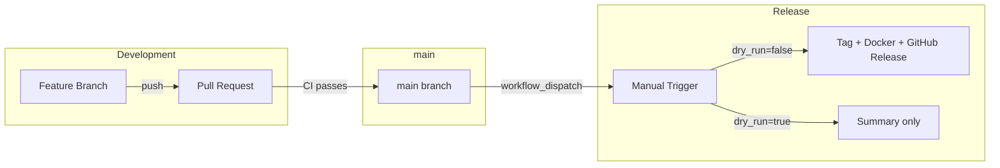
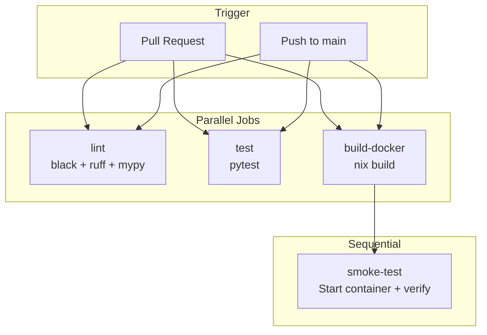
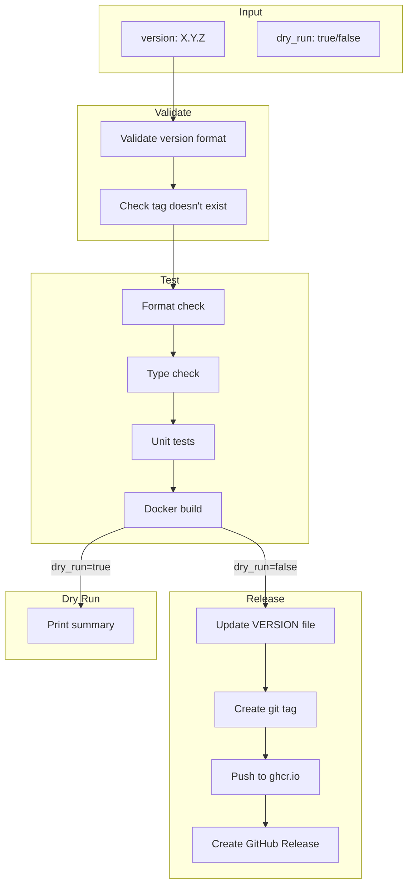

# CI/CD

This document describes the CI/CD workflows for building and releasing Whisper Server.

## Overview

Feature branches trigger CI on PR. After merge to main, releases are triggered manually. With `dry_run=false`, the release workflow creates a git tag, pushes the Docker image, and creates a GitHub release. With `dry_run=true`, no changes are made - only a summary is printed.

## CI Workflow

Runs automatically on every pull request and push to main:

## Release Workflow

Manual workflow triggered via GitHub Actions UI:

## Triggering a Release

1. Go to **Actions** > **Release** workflow
2. Click **Run workflow**
3. Enter version (e.g., `1.2.0`)
4. Optionally enable **dry run** to test without releasing
5. Click **Run workflow**

## Release Artifacts

| Artifact | Location |
|----------|----------|
| Docker image | `ghcr.io/paolino/whisper-server:X.Y.Z` |
| Docker latest | `ghcr.io/paolino/whisper-server:latest` |
| Git tag | `vX.Y.Z` |
| GitHub Release | Auto-generated notes |
