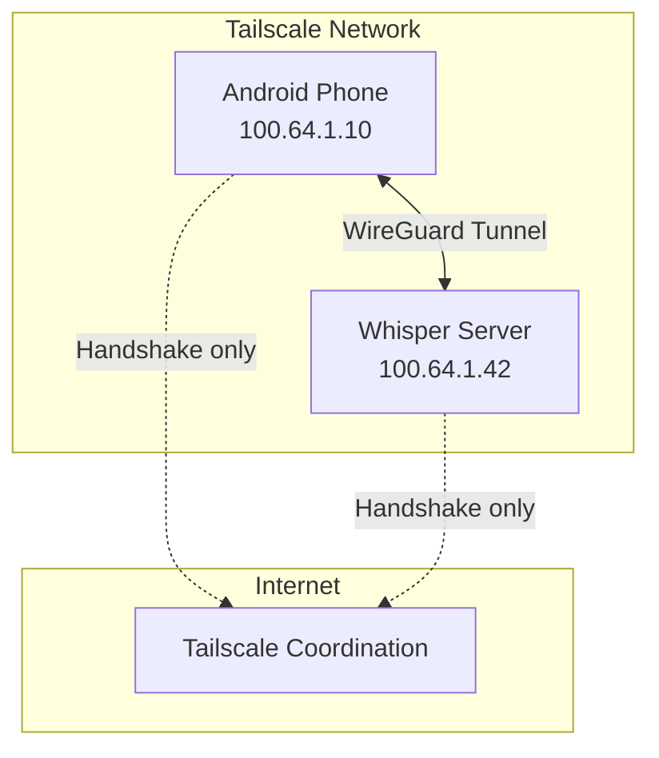
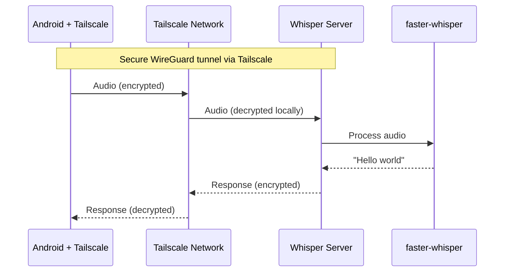

# Core Concepts

This document explains the key technologies used by Whisper Server.

## faster-whisper

### What is it?

[faster-whisper](https://github.com/SYSTRAN/faster-whisper) is a reimplementation of OpenAI's Whisper automatic speech recognition (ASR) model using [CTranslate2](https://github.com/OpenNMT/CTranslate2), a fast inference engine for Transformer models.

Whisper is a neural network trained by OpenAI on 680,000 hours of multilingual audio. It can:

- Transcribe speech to text in 99 languages
- Translate speech to English
- Detect the spoken language automatically

### Why we use it

faster-whisper provides significant advantages over the original OpenAI Whisper:

| Aspect | Original Whisper | faster-whisper |
|--------|------------------|----------------|
| Speed | Baseline | **4x faster** |
| Memory | ~5GB (large model) | **~2GB (large model)** |
| Accuracy | Baseline | Same |
| Dependencies | PyTorch | CTranslate2 (lighter) |

For a self-hosted server running on modest hardware, these improvements are essential.

### Available models

Models are downloaded from Hugging Face on first use (~150MB to ~3GB):

| Model | Size | English WER | Speed | Use case |
|-------|------|-------------|-------|----------|
| `tiny` | 39M | 7.6% | Fastest | Quick tests, low-resource |
| `base` | 74M | 5.0% | Fast | **Recommended default** |
| `small` | 244M | 3.4% | Medium | Better accuracy |
| `medium` | 769M | 2.9% | Slow | High accuracy |
| `large-v3` | 1550M | 2.5% | Slowest | Best accuracy |

WER = Word Error Rate (lower is better)

### How it's used

The server:

1. Receives raw PCM audio from Konele
2. Wraps it in a WAV header
3. Converts to numpy float32 array
4. Passes to faster-whisper with VAD (Voice Activity Detection) filtering
5. Returns transcribed text

```python
segments, _ = model.transcribe(
    audio_array,
    language="en",  # or None for auto-detect
    vad_filter=True,
)
text = " ".join(segment.text for segment in segments)
```

### Model caching

Models are cached in `~/.cache/huggingface/`. In Docker, mount a volume to persist:

```yaml
volumes:
  - huggingface-cache:/tmp/.cache
```

---

## Tailscale

### What is it?

[Tailscale](https://tailscale.com/) is a mesh VPN built on WireGuard. It creates a secure, private network between your devices without complex configuration.

Key features:

- **Zero-config**: Devices find each other automatically
- **End-to-end encryption**: WireGuard provides strong encryption
- **NAT traversal**: Works through firewalls and NAT
- **MagicDNS**: Access devices by hostname (`server.tailnet-name.ts.net`)

### Why we use it

Running a speech-to-text server creates privacy and security concerns:

| Problem | Tailscale Solution |
|---------|-------------------|
| Exposing server to internet | Only Tailscale devices can connect |
| Authentication complexity | Tailscale handles identity |
| Dynamic IPs | Stable Tailscale IPs |
| Firewall configuration | Automatic NAT traversal |

Your audio never leaves your private Tailscale network.

### Network topology



Data flows directly between devices. Tailscale servers only coordinate connections.

### How it's used

#### On the server (NixOS)

```nix
{
  services.tailscale.enable = true;

  services.whisper-server = {
    enable = true;
    tailscale.enable = true;  # Binds to Tailscale IP only
  };
}
```

This automatically:

- Starts the server on your Tailscale IP
- Opens port 9002 only on the Tailscale interface
- Blocks access from other networks

#### On Android

1. Install Tailscale from Play Store
2. Sign in with same account as server
3. Configure Konele with server's Tailscale IP

### Getting your Tailscale IP

```bash
# On the server
tailscale ip -4
# Example output: 100.64.1.42
```

Or use MagicDNS:
```
ws://myserver.tailnet-name.ts.net:9002
```

---

## How they work together



The combination provides:

- **Privacy**: Audio stays on your network
- **Security**: WireGuard encryption
- **Speed**: faster-whisper's optimized inference
- **Simplicity**: No auth code, no port forwarding
