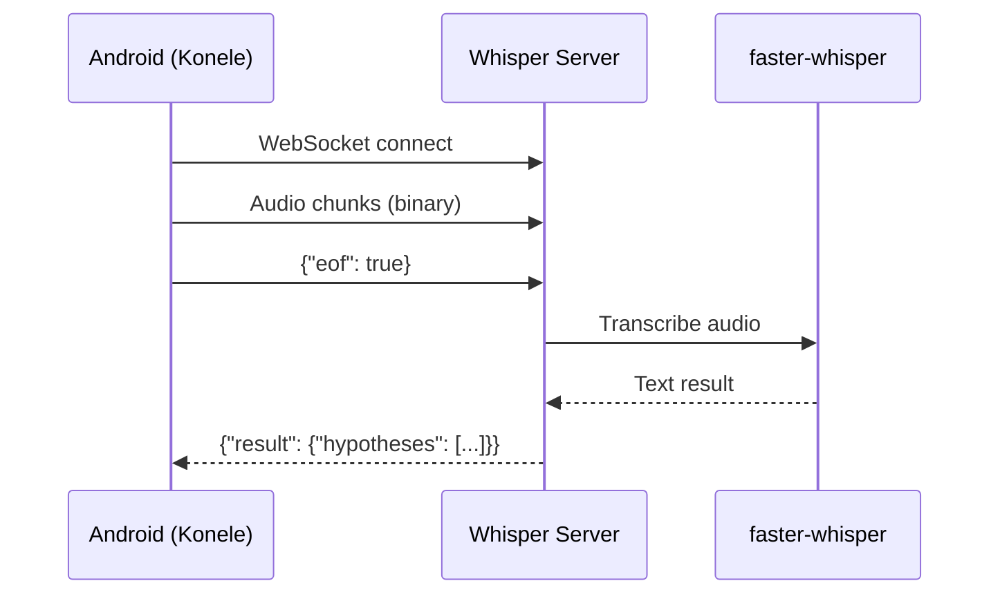

# Whisper Server

Self-hosted Whisper speech-to-text server compatible with [Konele](https://kaljurand.github.io/K6nele/) Android app.

## Features

- **WebSocket Server** - Implements Konele protocol for real-time transcription
- **Powered by faster-whisper** - Efficient CTranslate2-based Whisper implementation
- **Nix Flake** - Reproducible builds and development environment
- **Docker Support** - Easy deployment with Nix-built containers
- **Tailscale Ready** - Secure access from your Android device

## Quick Start

```bash
# Enter development shell
nix develop

# Run the server
just run

# Or with custom port and model
just run 9002 medium
```

## How It Works



## Next Steps

1. [Installation](installation.md) - Set up the server on NixOS
2. [Android Setup](android-setup.md) - Configure Konele on your phone
3. [Configuration](configuration.md) - Customize server options
4. [Architecture](architecture.md) - Understand the system design
